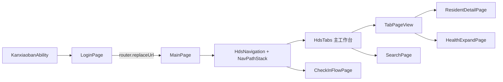
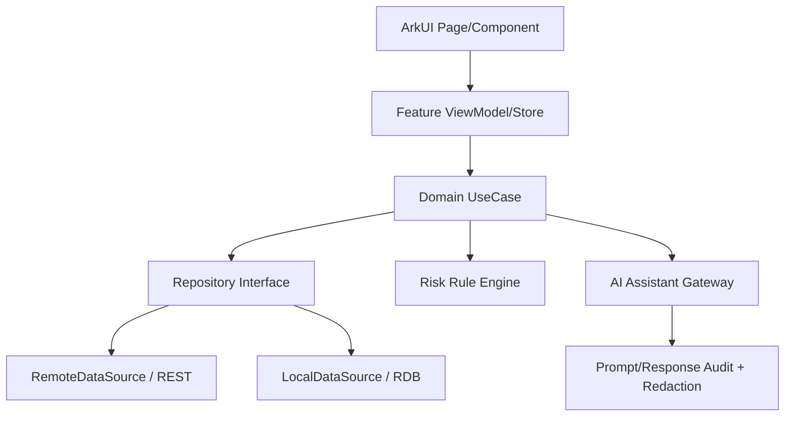

# KangxiaobanAI_OC ArkTS/HarmonyOS 全仓深度分析报告

> 审查日期：2026-07-12  
> 审查范围：`D:\KangxiaobanAI_OC` 全部顶层工程、核心 ArkTS 源码、工程配置、路由、资源、测试与构建信息  
> 重点对象：`KangxiaobanAI`（康小伴 AI 护工端）  
> 结论性质：代码现状审计、架构评估、参考工程知识地图与产品化改造建议

## 1. 执行摘要

本仓库不是一个普通的单体 HarmonyOS 应用，而是一个以 `KangxiaobanAI` 为业务原型、以多个华为/HarmonyOS 示例工程和大型案例库为技术参照的 ArkTS 研发工作区。全仓包含 17 个有实际源码的顶层项目，排除 `build`、`oh_modules`、IDE 缓存后，约有 3,800 个 `.ets` 文件和 300 余个 `module.json5`。其中 `cases`、`sample_in_harmonyos`、`HarmonyOSComponentUXExamples-dev` 构成知识库；`MusicHome`、`MultiDeviceCommunication`、`MultiCommunityApplication`、`NavigationSettings` 构成多模块、多端架构范本；其余工程分别覆盖响应式布局、转场、HDS 新视觉和 Account/Map/Push/Vision Kit。

`KangxiaobanAI` 本身已经不是空壳：它具备登录、首页、长者管理、任务管理、健康总览、入住登记、搜索、个人中心和长者详情等完整界面路径，采用 API 23 / HarmonyOS 6.1、ArkUI V2、AppStorageV2、HDS Navigation/Tabs、多断点布局和沉浸材质，视觉原型完整度较高。但它目前仍属于“高保真交互原型”，尚未达到“可接入真实养老机构生产环境”的程度。主要原因不是 UI，而是业务层、数据层、安全、测试和工程模块化尚未建立。

综合判断：

- 产品/交互原型完成度：约 75%。主要护理工作台已可被演示和评审。
- ArkUI/HDS 技术展示完成度：约 80%。新状态管理、HDS 和响应式能力使用较充分。
- 业务工程化完成度：约 35%。缺少 Repository、Service、API DTO、领域用例和离线同步。
- 生产安全与合规完成度：低于 20%。存在签名凭据入库、模拟登录、敏感数据治理缺失等问题。
- 自动化质量保障完成度：低于 10%。现有测试基本为 DevEco 模板断言。

最优策略不是继续向超大页面中堆 UI，而是冻结演示功能扩张，用 2～4 周完成安全清理、模块拆分、领域模型、真实认证、数据接口和测试基线，再继续增加 AI 与设备能力。

## 2. 审查方法与边界

本报告不是由 README 摘录生成。审查内容包括：

1. 遍历所有顶层目录，统计 ArkTS 源文件、模块配置和说明文档。
2. 检查应用级 `app.json5`、工程级 `build-profile.json5`、包配置和模块级 `module.json5`。
3. 从 Ability 的 `loadContent` 追踪首屏，核对 `main_pages.json`、router map、Navigation/NavPathStack 和 HDS 路由。
4. 扫描 ArkUI V1/V2 装饰器、AppStorageV2、HDS、窗口与断点工具、Kit 引用和权限声明。
5. 对 `KangxiaobanAI` 的全部 23 个主源 `.ets` 文件做结构扫描，并重点阅读入口、主页面、超大业务组件、详情页、入住流程、模型和工具类。
6. 检查测试是否覆盖真实业务，以及配置中是否存在凭据、绝对路径和环境耦合。
7. 将其他工程按“可直接复用的架构模式”而不是“项目介绍”进行归类。

本报告没有把 `build` 和 `oh_modules` 中的生成代码当作业务源码，也没有把样例 README 中声明的能力等同于已经在 `KangxiaobanAI` 中实现的能力。对于没有后端、设备或正式签名环境才能验证的内容，均按静态审查结论处理。

## 3. 全仓资产地图

| 项目 | 有效 ETS 数 | module 数 | 在工作区中的角色 | 对康小伴的价值 |
|---|---:|---:|---|---|
| `KangxiaobanAI` | 27 | 2 | 核心业务原型 | 主交付对象 |
| `cases` | 2311 | 267 | 大型能力与性能案例库 | 按问题检索实现，不应整体复制 |
| `sample_in_harmonyos` | 518 | 20 | 官方综合应用/组件工坊 | 大型工程、动态路由、公共服务参考 |
| `HarmonyOSComponentUXExamples-dev` | 483 | 5 | 多设备组件 UX 目录 | 组件交互与设备形态参考 |
| `MusicHome` | 106 | 8 | products/features/common 三层应用 | 康小伴模块化的最佳直接范本 |
| `ResponsiveLayout` | 62 | 1 | 响应式布局专项目录 | 护工站 PC/平板/折叠屏布局参考 |
| `MultiDeviceCommunication` | 56 | 7 | 多设备通讯应用 | 护工消息、联系人、备份能力参考 |
| `MultiCommunityApplication` | 53 | 6 | 社区内容多端应用 | 瀑布流、宽屏侧栏、内容组织参考 |
| `NavigationSettings` | 50 | 4 | 多端设置应用 | 参数化页面、ViewModel、命名路由参考 |
| `transitions-collection` | 46 | 1 | 一镜到底转场集合 | 长者卡片到详情页转场参考 |
| `multi-convenient-life` | 36 | 1 | 多端生活场景页面 | 分类列表/详情布局参考 |
| `Spatialization` | 25 | 2 | HDS、光感材质、智感握姿 | 康小伴现有 HDS 视觉来源之一 |
| `multi-tab-navigation` | 24 | 1 | Tab 样式集合 | 底部/侧边导航模式参考 |
| `push-kit...` | 15 | 1 | Push Kit 示例 | 护理告警、任务提醒参考 |
| `account-kit...` | 13 | 1 | Account Kit 元服务示例 | 正式身份体系参考，但需结合机构账号模型 |
| `map-kit...` | 7 | 1 | Map Kit 示例 | 院区定位、外出轨迹和电子围栏参考 |
| `visionkit...` | 2 | 1 | Vision Kit 活体检测 | 护工实名、敏感操作二次验证参考 |

这些项目不能被视为一个可统一编译的超级应用。它们跨越 HarmonyOS 5.0～6.1、API 12～23，多套工程模型与不同版本 HDS。正确使用方式是建立“能力索引”，按当前目标 SDK 选择最新实现并迁移，而不是直接复制旧 API 代码。

## 4. 核心应用定位与业务模型

`KangxiaobanAI` 的包名为 `com.gxoc.kxbai`，模块名为 `kanxiaoban`，当前支持 `phone`、`tablet`、`2in1`，最低和目标版本均为 HarmonyOS 6.1.0(23)。Ability 启动后加载 `pages/LoginPage`，登录成功后通过传统 router 的 `replaceUrl` 进入 `pages/MainPage`。

从源码呈现的角色和任务看，它定位为养老院/护理机构的一线护工工作台，而不是面向长者的家庭端应用。业务域可归纳为：

- 身份与班次：护工、护士、值班主管等角色，班次、绩效、培训与设置。
- 长者档案：入住信息、房间床位、风险分层、健康记录、情绪、足迹、饮食和设备。
- 护理任务：日程、AI 提醒、护理计划、长者关联任务、任务状态与交接班。
- 健康与安全：生命体征、异常事件、监测设备、用药进度、风险评估和告警。
- 入住管理：基本资料、房间床位、护理套餐等多步骤流程。
- 工作台：统计指标、快捷入口、待办、风险观察、健康信息与设备状态。

从界面信息架构看，主 Tab 已形成“首页—长者—任务—我的”的一线护理闭环。首页承担态势感知，长者页承担对象管理，任务页承担执行闭环，我的页面承载人员与偏好。这一结构合理，后续不建议继续增加一级 Tab；新增功能应放入二级 Navigation 目的地或按角色配置。

## 5. 启动、路由与页面链路

当前链路如下：



优点：

- 登录使用 `replaceUrl`，避免返回到登录页，方向正确。
- 主应用内部统一由 `HdsNavigation` 和 `NavPathStack` 承载，适合复杂二级页面。
- `@Provider('mainPageStack')` 可为子组件注入同一导航栈。
- 详情与扩展页面使用 `HdsNavDestination`，与 HDS 视觉体系一致。

问题：

- 应用同时使用传统 router 和 HDS Navigation。登录到主壳层的边界使用 router 可以接受，但需要明确规则：router 只负责“认证域/主应用域”切换，主应用内部全部使用 NavPathStack。
- `main_pages.json` 只声明登录和主页面；详情页是组件式 destination，不具备命名路由的可发现性和深链能力。
- 当前 Navigation 目的地大多以布尔状态和内嵌组件控制，随着业务增长会导致状态组合爆炸，恢复和跨设备续接也更难。
- 未见统一 RouteName、路由参数 DTO、登录拦截器或未授权重定向策略。

建议建立 `AppRoute` 枚举、强类型参数和单一 `NavigationService`。认证切换保留 router，业务导航统一 NavPathStack；需要通知落地、桌面卡片跳转或跨设备续接的页面应进入 router map/命名路由。

## 6. ArkUI V2 状态与响应式架构

核心应用采用 `@ComponentV2`、`@Local`、`@Param`、`@Event`、`@ObservedV2`、`@Trace`、`@Monitor`、`@Provider`，技术方向是正确的。`GlobalInfoModel` 和 `HomeSearchState` 通过 `AppStorageV2.connect` 连接，窗口工具把 UIContext、窗口宽高、方向、键盘高度和断点写入全局状态。

状态大致可分为三类：

| 类型 | 当前实现 | 评估 |
|---|---|---|
| 环境状态 | `GlobalInfoModel` + `WindowUtil` | 合理，可继续保留 |
| 跨组件 UI 状态 | `HomeSearchState`、导航栈 Provider | 基本合理，但需限制生命周期 |
| 业务数据/筛选状态 | 大量放在 `TabPageView` 的 `@Local` 字段 | 过度集中，应迁移到 ViewModel/Store |

`WindowUtil` 监听窗口大小、可见区域和键盘，结合 `BreakpointType<T>` 返回不同断点值，这是本项目较成熟的部分。它支持 phone、tablet、2in1 的布局差异，也为后续宽屏侧栏与底部浮动 Tab 切换提供了基础。

主要风险是“全局状态连接被多处重复调用”。连接 AppStorageV2 时应有清晰的初始化所有权，并确保断开监听、窗口回调和页面销毁时的清理。业务对象不应因为方便而全部进入全局状态，否则护理任务、长者详情和登录会互相污染。

建议状态边界：

- App 级：Session、Tenant、CurrentUser、Theme、WindowInfo。
- Feature 级：ResidentListStore、TaskStore、DashboardStore、CheckInDraftStore。
- Page 级：搜索文本、选中项、sheet 展开、动画 geometryId。
- 瞬时事件：Toast、Navigation、一次性告警使用事件/服务，不进入持久全局状态。

## 7. UI/HDS 与多设备设计评估

主页面使用 `HdsNavigation`、`HdsTabs`、`HdsListItemCard`、材质效果、MiniBar 和宽屏侧栏，符合 HarmonyOS 6.1 新视觉方向。手机端使用底部悬浮 Tab，宽屏端使用侧栏和内容区，是合理的跨形态策略。`Repeat`、`WaterFlow` 和 Scroller map 的使用说明作者关注了列表渲染与滚动状态。

值得保留的实现：

- 主导航针对窄屏/宽屏切换布局。
- `HdsTabsController` 管理选中态，不依赖脆弱的手工同步。
- MiniBar 折叠/展开状态与浮动栏样式联动。
- 长者详情和健康展开页沿用 HDS destination，视觉一致。
- 卡片组件已初步抽取为 Health/Event/Device 三类。
- geometryId 已为卡片到详情的共享元素动画留出通路。

需要整改的点：

- `TabPageView.ets` 达 2754 行，`ResidentDetailPage.ets` 1036 行，`MainPage.ets` 747 行。这不仅是可读性问题，还会扩大 ArkUI 状态重建范围、增加编译负担和回归风险。
- 大量业务文案、颜色和尺寸仍直接写在 `.ets` 中。项目虽有资源文件，但资源化不充分，国际化和主题一致性会受影响。
- 部分列表用 `Repeat(this.filtered...())` 在 build 路径反复计算筛选结果；数据增长后需要缓存派生数据或 ViewModel 预计算。
- 页面内创建大批模拟对象，既增加首帧负担，也使 UI 与数据构造耦合。
- 需要验证大字号、屏幕阅读器、焦点顺序、键盘操作、2in1 hover/鼠标状态和色彩对比度。目前源码没有形成可访问性规范层。

## 8. 数据、服务和 AI 能力现状

当前代码未形成真实网络层。模块依赖为空，未见统一 HTTP 客户端、认证 token、API endpoint、Repository、数据库 schema 或同步队列。登录通过 `setTimeout` 模拟等待后直接进入主页面；长者、任务、健康、设备、入住和详情数据大多在组件方法中构造。

这意味着当前“AI”主要体现在产品命名、界面内容和 AI 标签，而不是可审计的模型调用链。尚未看到：

- 模型服务 SDK 或 HTTP 调用；
- Prompt 模板和版本管理；
- 推理请求/响应 DTO；
- 流式响应、中断、超时、重试与降级；
- 敏感健康数据脱敏；
- AI 建议的置信度、依据、免责声明和人工确认；
- 告警规则与模型建议的职责边界；
- 模型输出审计日志。

养老护理属于高敏感、高责任场景。AI 应定位为辅助决策，不能直接改变用药、护理等级或紧急处置。建议将能力分三层：

1. 确定性规则：生命体征阈值、设备离线、任务超时、漏服药等，由规则引擎产生告警。
2. AI 辅助：交接班摘要、护理记录结构化、风险趋势解释、任务优先级建议。
3. 人工确认：任何会改变护理计划、风险等级和医疗相关动作的输出必须由有权限人员确认。

推荐数据架构：



## 9. 模块化和代码组织

当前核心应用只有一个 entry HAP，所有页面、模型和工具均位于同一模块。对 7,600 行左右的原型尚可，但对养老机构业务继续增长并不合适。全仓的 `MusicHome` 已提供可直接借鉴的 products/features/common 分层方式。

建议目标结构：

```text
KangxiaobanAI/
├─ common/
│  ├─ core/              # 日志、错误、Result、时间、配置
│  ├─ network/           # HTTP、鉴权、拦截、DTO 基础
│  ├─ database/          # RDB、迁移、加密与离线队列
│  ├─ design-system/     # HDS 封装、主题、通用卡片
│  └─ domain-model/      # Resident、Task、Alert 等稳定模型
├─ features/
│  ├─ auth/
│  ├─ dashboard/
│  ├─ resident/
│  ├─ task/
│  ├─ health/
│  ├─ checkin/
│  ├─ notification/
│  └─ ai-assistant/
└─ products/
   ├─ caregiver/         # 当前手机/平板/2in1 HAP
   └─ station/           # 若护理站 PC 业务差异扩大，再独立产品
```

拆分原则不是“一页一个 HAR”，而是按稳定业务边界拆分。`TabPageView` 首先应拆为 Dashboard、Resident、Task、Profile 四个 feature root；详情页按 Overview/Health/Medication/Device/CareTask 等 section 拆组件；模拟数据移到独立 FakeRepository，确保以后替换远端实现时 UI 无需重写。

## 10. 安全、隐私与合规审计

### P0：签名凭据进入版本库

`KangxiaobanAI/build-profile.json5` 当前包含本机证书、p12、p7b 绝对路径，以及 key/store password 字段。无论这些值是否仅用于 debug，都不应出现在共享仓库。必须立即：

1. 撤销/轮换已暴露的签名材料和密码；
2. 从版本历史清除敏感值，而不只是删除当前文件中的字段；
3. 使用 DevEco 本地 signing config、环境变量或 CI 密钥存储注入；
4. 提供不含真实材料的 `build-profile.example.json5`；
5. 增加 secret scan，阻止再次提交。

### P0：认证是模拟逻辑

任意账号密码都能在延时后进入系统；没有 token、租户、角色权限、会话过期和设备绑定。正式接入前必须建立 Account/AuthService、RBAC、刷新 token、安全存储和退出时清理。

### P1：护理健康数据保护缺失

源码展示的长者健康、用药、足迹、情绪、房间和风险数据属于高度敏感信息。需要最小权限、传输加密、落盘加密、操作审计、截屏策略、日志脱敏、数据保留策略和租户隔离。日志中禁止记录姓名、身份证、床号与 token 的组合。

### P1：权限模型尚未建立

主模块没有 `requestPermissions`，这与当前纯 UI 原型一致。但将来接入相机、麦克风、定位、通知、蓝牙或生物认证时，必须同时完成 module 声明、运行时请求、拒绝路径、能力探测和用途说明。不能因为样例工程已有权限就直接照搬全部权限。

### P1：AI 医疗/护理责任边界

风险判断和护理建议必须显示来源、时间、生成者、置信度/规则依据及确认状态。模型不可绕过授权直接执行护理或医疗动作。

## 11. 性能评估

现有实现已经使用 `Repeat`、`WaterFlow`、Scroller、响应式断点等较新的 ArkUI 能力，但性能风险主要来自架构：

- 超大组件包含大量 Builder、数组构造、筛选和 UI 状态，任何局部状态变化都可能扩大重建范围。
- mock 数据在页面类中同步生成，增加实例化和维护成本。
- 列表派生方法可能在 build 周期重复执行。
- 多处 AppStorageV2 connect 与窗口状态传播，需要确认不会导致冗余刷新。
- 未建立首帧、页面切换、长列表帧率、内存、CPU 和冷启动基线。

建议指标：

- 冷启动到可交互：在目标中端设备上设定基线并持续回归。
- 首页首帧：业务数据异步加载，骨架先显示；禁止首帧构造完整详情数据。
- 长者列表：500/2000 条数据压测，检查滑动帧率、内存与组件复用。
- 详情页：按 section 懒加载，趋势图和设备历史按需查询。
- 搜索：输入去抖、后台任务/服务查询，避免主线程全量过滤。
- 使用 SmartPerf、Profiler、ArkUI Inspector 和 HiDumper 形成发布前报告。

可优先回查 `cases` 中 list optimization、component reuse、highly loaded component、taskpool、cold start、cache 和 layout 相关案例，但迁移时应选择与 API 23 兼容的实现。

## 12. 测试与质量现状

当前 `LocalUnit.test.ets`、`Ability.test.ets` 等仍是模板的字符串包含断言，没有覆盖业务。没有看到针对以下关键路径的有效测试：

- 登录成功/失败、角色和会话过期；
- 首页统计与告警数据映射；
- 长者筛选、风险分层和详情导航；
- 任务筛选、状态转换、重复提交和离线恢复；
- 入住流程校验、草稿保存和提交；
- 断点切换、窗口旋转、键盘避让；
- 中文/英文、暗色模式和大字号；
- Repository 错误、超时、重试、缓存和同步冲突。

建议质量金字塔：

- 单元测试：UseCase、ViewModel、规则、映射、验证器、Repository fake。
- 组件测试：卡片、筛选器、表单步骤、空态/错误态/加载态。
- UI 自动化：登录—首页—长者详情—任务完成—入住提交主路径。
- 契约测试：API schema、错误码、分页、幂等和权限。
- 性能测试：启动、长列表、搜索、详情切换和内存泄漏。

发布门禁至少包含：编译、lint、单测、关键 UI 测试、secret scan、依赖许可证和 HAP 签名验证。

## 13. 各参考项目的深入使用建议

### 13.1 MusicHome

这是全仓最适合用于重构 `KangxiaobanAI` 的架构范本。它将产品入口、推荐、播放、歌单和基础模型拆为多个 HAP/HAR，并用 router map 暴露 feature 页面。应学习模块职责、公共状态位置、feature 导出方式和多产品装配；不要复制音乐领域状态本身。

### 13.2 sample_in_harmonyos

它是大型综合应用范本，覆盖多个产品形态、公共服务和动态内容。适合研究大型路由、组件库、公共业务、存储和设备差异。但它本身是样例聚合器，抽象层比康小伴所需更重，不能整套照搬。

### 13.3 cases

这是按具体问题查询的“工程百科”，包含 2,300 余个 ETS 和大量性能正反例。应用方式应是：先用 profiler 证明问题，再找到同版本案例，对照正反实现做最小迁移。禁止把它当公共依赖或无差别复制。

### 13.4 HarmonyOSComponentUXExamples-dev

适合建立康小伴 Design System 和多设备组件行为规范，尤其是 phone/PC/wearable 产品差异、路由 map 和组件 UX。它可帮助补齐可访问性、输入方式和设备形态评审。

### 13.5 ResponsiveLayout

对护理站宽屏非常重要。应重点吸收单/双/三栏、SideBarContainer、Navigation 分栏、GridRow/GridCol 和断点工具。康小伴已有 BreakpointType，可对齐其更完整的宽屏布局策略。

### 13.6 NavigationSettings

适合参考 V2 `@Param/@Event` 参数化页面、ViewModel 和设置类信息架构。康小伴“我的/设置/权限/班次”模块可直接借鉴其页面职责划分。

### 13.7 MultiDeviceCommunication

适合未来的护工消息、交接班沟通、联系人和多设备备份。它展示 products/features/common 分层和 backup extension，但目前康小伴不应在核心数据模型稳定前先做复杂分布式通讯。

### 13.8 MultiCommunityApplication

可参考宽屏侧栏和内容流，但养老护理不是内容社区，不应把 WaterFlow 当作所有业务列表的默认布局。任务和告警更适合确定顺序的 List。

### 13.9 Spatialization

它解释了当前项目 HDS、材质和浮动导航的来源。可继续用于 API 601+ 的 HDS 行为参考，同时应为低版本或能力不可用场景准备降级；若产品最低版本固定 API 23，则可以减少旧版兼容分支。

### 13.10 transitions-collection

可用于长者卡片—详情、告警卡片—处置页的一镜到底体验。动效必须服务于空间连续性，不能延迟紧急任务操作；Reduce Motion 场景需提供降级。

### 13.11 multi-tab-navigation

主导航模式已经确定，继续参考它的价值主要在选中态、侧边栏和嵌套 Tab，而不是再增加更多样式。

### 13.12 Kit 专项样例

- Account Kit：用于实名认证或华为账号能力，但机构账号仍需自有租户/RBAC。
- Push Kit：用于护理告警和任务提醒；消息只携带最小标识，敏感详情进 App 后鉴权查询。
- Map Kit：用于院区定位、外出轨迹、围栏；需单独评估定位权限和告知同意。
- Vision Kit：可用于活体核验；不能默认开启摄像头，需清晰用途和拒绝路径。

## 14. 关键风险清单与优先级

| 优先级 | 风险 | 证据/现状 | 建议 |
|---|---|---|---|
| P0 | 签名秘密入库 | build profile 含路径和密码字段 | 立即轮换并清理历史 |
| P0 | 无真实认证 | 登录延时后直接进入 | 接入 Auth、RBAC、会话安全 |
| P0 | 业务数据全为原型 | 页面内 mock/静态数组 | 建 Repository 和 API 契约 |
| P1 | 超大组件 | 2754/1036/747 行核心文件 | 按 feature/section 拆分 |
| P1 | 敏感数据治理缺失 | 健康、用药、足迹、情绪 | 加密、审计、脱敏、隔离 |
| P1 | 无有效自动化测试 | 模板 assertContain | 建单测、UI、契约门禁 |
| P1 | AI 不可审计 | 无模型网关与人工确认 | 建 AI Gateway 与审计链 |
| P2 | 资源化不足 | 页面硬编码文案/样式 | 迁移 string/color/float |
| P2 | 路由策略未制度化 | router 与 HDS Navigation 混用 | 定义认证/业务路由边界 |
| P2 | 性能无基线 | 无 profiler 报告 | 建启动、列表、内存基线 |
| P3 | 文档与事实漂移 | Memory 乱码、README 不完整 | 自动生成架构/模块清单 |

## 15. 推荐实施路线

### 第 0 阶段：立即处理（1～2 天）

- 轮换签名材料，移除凭据与绝对路径，清理 Git 历史。
- 冻结 `TabPageView` 新增功能。
- 建立编译、lint、secret scan 的最小 CI。
- 记录当前 UI 截图和关键交互，作为重构回归基线。

### 第 1 阶段：架构基线（1 周）

- 建 common/core、network、domain-model 和 feature 目录/HAR。
- 定义 Result、AppError、分页、Session、Tenant、UserRole。
- 把 mock 数据迁入 FakeRepository。
- 将四个一级 Tab 拆为独立 feature root，不改变界面。
- 定义路由表和强类型参数。

### 第 2 阶段：真实业务闭环（1～2 周）

- 接入登录、刷新 token、退出、角色授权。
- 接入长者列表/详情、任务列表/更新、首页摘要 API。
- 建本地缓存与弱网策略，明确冲突解决和幂等。
- 入住流程支持草稿、字段验证、提交和失败恢复。

### 第 3 阶段：质量与安全（1 周）

- 补齐核心 UseCase/ViewModel 单测和关键 UI 自动化。
- 做日志脱敏、操作审计、数据库加密和截屏策略。
- 做长列表、启动、内存和多窗口测试。
- 完成中英文、暗色、大字号、键盘和无障碍检查。

### 第 4 阶段：AI 与设备能力（持续）

- 先上线交接班摘要和护理记录结构化等低风险能力。
- 再接规则告警解释、趋势总结，始终保留人工确认。
- 接入 Push 告警；按真实业务再评估地图、活体和蓝牙设备。
- 建 Prompt/模型版本、输出审计、脱敏和降级策略。

## 16. 建议的验收标准

达到“可试点”至少应满足：

- 仓库和历史中无有效签名秘密；CI secret scan 通过。
- 登录、鉴权、退出和角色权限真实可用。
- 首页、长者、任务、入住至少各有一个后端闭环。
- 断网、超时、空数据、无权限、服务错误均有明确 UI 状态。
- 敏感数据落盘加密，日志不泄露个人/健康信息。
- 核心领域逻辑单测覆盖，四条主路径 UI 自动化通过。
- phone、tablet、2in1 的关键断点和旋转场景通过。
- 长列表与启动性能有实机基线，无明显掉帧和泄漏。
- AI 输出可追溯、可拒绝、可人工确认，不直接执行高风险动作。

## 17. 最终结论

这个工作区的价值很高：它不仅有康小伴业务原型，也包含足够丰富的 HarmonyOS 官方工程模式，可以支撑从原型走向成熟 ArkTS 产品。核心应用的 UI 技术选型基本正确，HDS、多设备、ArkUI V2 和导航框架都已形成不错的基础；真正的短板集中在“页面之后”的工程能力。

下一阶段应把目标从“继续补页面”切换为“建立可信业务系统”：先解决签名与认证，再建立领域/数据层、拆分超大组件、补足测试和隐私治理，最后接入可审计的 AI。若按本报告路线推进，现有界面资产大部分可以保留，重构重点会落在数据来源、状态边界和模块职责，而不是推倒重做 UI。

---

### 附录：核心事实索引

- 应用入口：`KangxiaobanAI/products/entry/src/main/ets/entryability/EntryAbility.ets`
- 登录页：`KangxiaobanAI/products/entry/src/main/ets/pages/LoginPage.ets`
- 主工作台：`KangxiaobanAI/products/entry/src/main/ets/pages/MainPage.ets`
- 最大业务组件：`KangxiaobanAI/products/entry/src/main/ets/component/TabPageView.ets`
- 长者详情：`KangxiaobanAI/products/entry/src/main/ets/pages/ResidentDetailPage.ets`
- 入住流程：`KangxiaobanAI/products/entry/src/main/ets/component/CheckInFlowPage.ets`
- 窗口/断点状态：`KangxiaobanAI/products/entry/src/main/ets/util/WindowUtil.ets`
- 模块配置：`KangxiaobanAI/products/entry/src/main/module.json5`
- 工程配置：`KangxiaobanAI/build-profile.json5`
- 推荐模块化范本：`MusicHome`
- 推荐响应式范本：`ResponsiveLayout`
- 推荐能力/性能索引：`cases`
